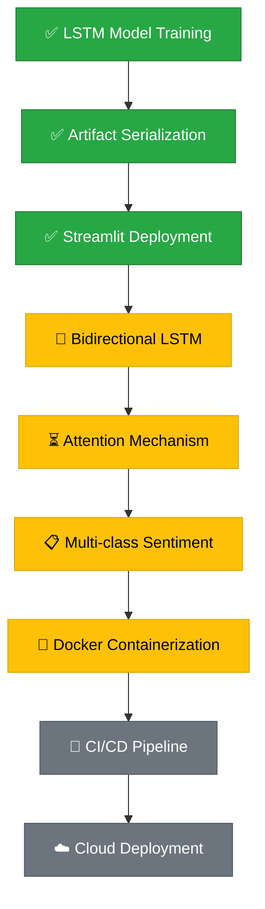

<div align="center">


<!-- ═══════════ BADGES ═══════════ -->

[](https://github.com)
[](LICENSE)
[](https://github.com)
[](https://github.com)

[](https://python.org)
[](https://tensorflow.org)
[](https://keras.io)
[](https://streamlit.io)
[](https://numpy.org)
[](https://pandas.pydata.org)

<!-- ═══════════ TYPING SVG ═══════════ -->

<p align="center">
  
</p>

</div>

---

## 🧭 **Quick Navigation**

<div align="center">

| [🎯 Overview](#-overview) | [✨ Features](#-features) | [🏗️ Architecture](#️-architecture) | [🚀 Quick Start](#-quick-start) |
|:--:|:--:|:--:|:--:|
| [📊 Demo](#-demo--screenshots) | [⚙️ Configuration](#️-configuration) | [🛠️ Tech Stack](#️-tech-stack) | [📈 Performance](#-performance-metrics) |
| [🗺️ Roadmap](#️-roadmap) | [🤝 Contributing](#-contributing) | [👨‍💻 Author](#-author) | [⭐ Support](#-show-your-support) |

</div>

---

## 🎯 **Overview**

<table align="center">
<tr>
<td align="center"><h3>🔍 What</h3></td>
<td align="center"><h3>💡 Why</h3></td>
</tr>
<tr>
<td align="center">
<b>Production-Ready Sentiment Classifier</b><br/>
An end-to-end LSTM neural network that processes<br/>
raw text and predicts <b>POSITIVE / NEGATIVE</b> sentiment,<br/>
deployed as an interactive Streamlit web application.
</td>
<td align="center">
<b>Industry-Standard NLP Pipeline</b><br/>
Demonstrates the complete ML workflow — from<br/>
data preprocessing and model training to artifact<br/>
serialization and real-time inference deployment.
</td>
</tr>
</table>

<div align="center">

```
🎯 Mission: Transform raw text into actionable sentiment insights
            using LSTM neural networks — trained once, deployed for real-time inference.
```

</div>

---

## ✨ **Features**

<div align="center">

| Feature | Status | Description |
|:--------|:------:|:------------|
| 🔤 **Word-Level Tokenization** | ✅ | Custom vocabulary (20 k words) with OOV handling via `<OOV>` token |
| 🧠 **LSTM Architecture** | ✅ | Many-to-One sequence modeling, 128 units with recurrent dropout |
| 📊 **Trainable Embeddings** | ✅ | 128-dimensional word vector representations learned during training |
| 🎯 **Binary Classification** | ✅ | POSITIVE / NEGATIVE prediction with sigmoid threshold at 0.5 |
| 🌐 **Streamlit Web App** | ✅ | Real-time interactive inference with cached model loading |
| 💾 **Model Serialization** | ✅ | Saved `.h5` model + `.pkl` tokenizer for deployment reuse |
| 📏 **Padding & Masking** | ✅ | Post-padding to 200 tokens with zero-mask to protect LSTM state |
| 🔒 **Config Parity** | ✅ | Training and inference use identical preprocessing parameters |
| 🎚️ **Confidence Indicator** | ✅ | Qualitative certainty levels (Very High / High / Moderate / Low) |
| ⚡ **Cached Inference** | ✅ | `st.cache_resource` loads artifacts once — sub-second predictions |
| 💡 **Quick Examples** | ✅ | One-click positive, negative, and nuanced test inputs |
| 📋 **Model Card Sidebar** | ✅ | Architecture specs and pipeline steps visible at a glance |

</div>

---

## 🏗️ **Architecture**

<div align="center">

```ascii
┌──────────────────────────────────────────────────────────────────────┐
│                  🧠 LSTM SENTIMENT ANALYSIS PIPELINE                │
└──────────────────────────────────────────────────────────────────────┘

     📄 Raw Text Input
          │
          ▼
     ┌──────────────────────────────┐
     │  🔤  TOKENIZATION LAYER     │
     │  ─────────────────────────── │
     │  Keras Tokenizer             │
     │  Vocabulary : 20,000 words   │
     │  OOV Token  : <OOV>          │
     │  Lowercased : True           │
     └──────────────┬───────────────┘
                    │  integer sequences
                    ▼
     ┌──────────────────────────────┐
     │  📏  PADDING & MASKING      │
     │  ─────────────────────────── │
     │  Max Length  : 200 tokens    │
     │  Padding     : post          │
     │  Truncating  : post          │
     │  Mask Zero   : True          │
     └──────────────┬───────────────┘
                    │  fixed-shape tensor
                    ▼
     ┌──────────────────────────────┐
     │  🎯  EMBEDDING LAYER        │
     │  ─────────────────────────── │
     │  Input Dim   : 20,000        │
     │  Output Dim  : 128           │
     │  Trainable   : True          │
     │  Mask Zero   : True          │
     └──────────────┬───────────────┘
                    │  (batch, 200, 128)
                    ▼
     ┌──────────────────────────────┐
     │  🧠  LSTM LAYER             │
     │  ─────────────────────────── │
     │  Units       : 128           │
     │  Type        : Many-to-One   │
     │  Dropout     : 0.2           │
     │  Rec Dropout : 0.2           │
     │  Return Seq  : False         │
     └──────────────┬───────────────┘
                    │  (batch, 128)
                    ▼
     ┌──────────────────────────────┐
     │  🎲  DENSE + SIGMOID        │
     │  ─────────────────────────── │
     │  Units       : 1             │
     │  Activation  : Sigmoid       │
     │  Threshold   : 0.5           │
     └──────────────┬───────────────┘
                    │
                    ▼
     ┌──────────────────────────────┐
     │  📊  OUTPUT                  │
     │  ─────────────────────────── │
     │  ≥ 0.5 → 😊 POSITIVE        │
     │  < 0.5 → 😞 NEGATIVE        │
     │  + Confidence Level          │
     └──────────────────────────────┘
```

</div>

---

<details>
<summary><h2>🔬 <b>Technical Deep Dive</b></h2></summary>

### 🧬 **Model Specifications**

| Component | Configuration | Rationale |
|:----------|:--------------|:----------|
| **Vocabulary Size** | 20,000 tokens | Balances lexical coverage vs. embedding matrix size |
| **Sequence Length** | 200 tokens | Captures most review content without over-padding |
| **Embedding Dim** | 128 dimensions | Adequate semantic representation for sentiment |
| **LSTM Units** | 128 cells | Sufficient memory capacity for sequence dependencies |
| **Dropout** | 0.2 + 0.2 recurrent | Regularization against overfitting |
| **Activation** | Sigmoid | Binary classification output ∈ [0, 1] |
| **Masking** | `mask_zero=True` | Prevents padded zeros from corrupting LSTM hidden state |

### 🔧 **Training Configuration**

```python
# ── Reproducibility ──
tf.random.set_seed(42)
np.random.seed(42)

# ── Hyperparameters ──
VOCAB_SIZE  = 20000
MAX_LEN     = 200
EMBED_DIM   = 128
LSTM_UNITS  = 128
BATCH_SIZE  = 32
EPOCHS      = 5

# ── Optimizer & Loss ──
optimizer   = "adam"          # Adam (lr = 0.001 default)
loss        = "binary_crossentropy"
metrics     = ["accuracy"]
val_split   = 0.2            # 20% of training data
```

### 📊 **Data Pipeline**

```
CSV (240k records)
  │
  ├─ 1. Column inference         → detect text & label columns
  ├─ 2. Label normalization      → map to binary {0, 1}
  ├─ 3. Stratified train/test    → 80/20 split (random_state=42)
  ├─ 4. Word-level tokenization  → Keras Tokenizer (fit on train only)
  ├─ 5. Sequence encoding        → texts_to_sequences()
  ├─ 6. Post-padding / truncate  → fixed 200-token tensors
  └─ 7. Batched training         → 32 samples/batch × 5 epochs
```

### 🎯 **Design Decisions**

| Decision | Why It Matters |
|:--|:--|
| Tokenizer fit on training data only | Prevents data leakage from test set vocabulary |
| Post-padding (not pre-padding) | With `mask_zero=True`, padding position is irrelevant — mask handles it |
| OOV token `<OOV>` | Gracefully handles unseen words at inference without crashes |
| No pre-trained embeddings | Demonstrates learned representations; keeps dependencies minimal |
| Single LSTM (no Bi-LSTM) | Sufficient for binary sentiment; prioritizes clarity over complexity |
| Pickle for tokenizer | Preserves word index + config exactly as fitted; standard practice |

</details>

---

## 📂 **Project Structure**

```
🎯 sentiment-analysis-lstm/
│
├── 🌐 app/
│   ├── app.py                         # 🚀 Streamlit inference application
│   └── requirements.txt               # 📦 Runtime dependencies (minimal)
│
├── 🤖 model/
│   ├── lstm_sentiment.h5              # 💾 Trained LSTM model (Keras HDF5)
│   └── tokenizer.pkl                  # 🔤 Fitted Keras Tokenizer (pickle)
│
├── 📓 notebook/
│   ├── sentiment_lstm_kaggle.ipynb    # 🔬 Training & evaluation notebook
│   └── sentiment_lstm_kaggle.py       # 📄 Exported Python script
│
├── 📊 data/
│   └── sentiment_data.csv             # 📋 Kaggle dataset (~240k records)
│
├── 📝 README.md                       # 📖 This file
└── 🚫 .gitignore                      # 🔒 Git ignore rules
```

---

## 🚀 **Quick Start**

### 📋 **Prerequisites**

<div align="center">

| Requirement | Version | Check Command |
|:------------|:--------|:--------------|
| **🐍 Python** | 3.8+ | `python --version` |
| **📦 pip** | Latest | `pip --version` |
| **🔗 Git** | Latest | `git --version` |

</div>

### ⚡ **Installation Steps**

```bash
# 1️⃣ Clone the repository
git clone https://github.com/dinraj910/sentiment-analysis-lstm.git
cd sentiment-analysis-lstm

# 2️⃣ Install dependencies
pip install -r app/requirements.txt

# 3️⃣ Launch the Streamlit app
streamlit run app/app.py

# 4️⃣ Open in browser
# 🌐 Local URL: http://localhost:8501
```

### 🔧 **Development Setup**

```bash
# 📓 Open the training notebook
cd notebook
jupyter notebook sentiment_lstm_kaggle.ipynb
```

---

## 📊 **Demo & Screenshots**

<div align="center">

### 🎬 **Live Prediction Examples**

| Input Text | Prediction | Confidence |
|:-----------|:-----------|:-----------|
| *"This product is amazing and exceeded all my expectations!"* | 😊 **POSITIVE** | Very High |
| *"Terrible quality. It broke after one day."* | 😞 **NEGATIVE** | Very High |
| *"The camera is great but the battery life is disappointing."* | 🤔 **Context-dependent** | Moderate |

### 💻 **Web Interface**

```ascii
┌─────────────────────────────────────────────────────┐
│  🧠 LSTM Sentiment Analyzer                        │
│  ─────────────────────────────────────────────────  │
│                                                     │
│  📝 Enter text to analyze:                          │
│  ┌─────────────────────────────────────────────┐    │
│  │ The movie was absolutely incredible and      │    │
│  │ the acting was phenomenal...                 │    │
│  └─────────────────────────────────────────────┘    │
│                                                     │
│          [🔍 Analyze Sentiment]                     │
│                                                     │
│  ┌─────────────────────────────────────────────┐    │
│  │ 😊 POSITIVE                                 │    │
│  │ Confidence: Very High                        │    │
│  │ ████████████████████████░░░░  Very High      │    │
│  └─────────────────────────────────────────────┘    │
│                                                     │
│  ── 💡 Quick Examples ──────────────────────────    │
│  [ Positive ]  [ Negative ]  [ Nuanced ]           │
│                                                     │
│  ┌─ 🧠 Model Card (Sidebar) ──────────────────┐    │
│  │ Architecture : LSTM (Many-to-One)           │    │
│  │ Embedding    : 128-d, trainable             │    │
│  │ LSTM Units   : 128                          │    │
│  │ Vocab Size   : 20,000                       │    │
│  │ Seq Length    : 200 (post-padded)            │    │
│  └─────────────────────────────────────────────┘    │
└─────────────────────────────────────────────────────┘
```

</div>

---

## ⚙️ **Configuration**

<div align="center">

### 🔧 **App Configuration (must match training)**

| Variable | Value | Description |
|:---------|:------|:------------|
| `MODEL_PATH` | `model/lstm_sentiment.h5` | Path to trained Keras model |
| `TOKENIZER_PATH` | `model/tokenizer.pkl` | Path to fitted tokenizer |
| `MAX_LEN` | `200` | Maximum sequence length (post-padded) |
| `THRESHOLD` | `0.5` | Sigmoid classification threshold |

### 🧠 **Training-Time Configuration (locked)**

| Variable | Value | Description |
|:---------|:------|:------------|
| `VOCAB_SIZE` | `20,000` | Maximum vocabulary size |
| `EMBED_DIM` | `128` | Embedding vector dimensions |
| `LSTM_UNITS` | `128` | LSTM hidden state size |
| `BATCH_SIZE` | `32` | Training mini-batch size |
| `EPOCHS` | `5` | Training iterations |

### 📦 **Runtime Dependencies**

```txt
tensorflow>=2.10.0     # Model loading & inference
streamlit>=1.28.0      # Web application framework
numpy>=1.21.0          # Numerical operations
```

> ⚡ Training-only libraries (pandas, sklearn, matplotlib) are intentionally excluded from runtime.

</div>

---

## 🛠️ **Tech Stack**

<div align="center">

### 🧠 **Core Technologies**

| Category | Technologies |
|:---------|:-------------|
| **🤖 Deep Learning** |   |
| **🐍 Language** |  |
| **🌐 Deployment** |  |
| **📊 Data & NLP** |   |
| **📈 Visualization** |  |
| **💾 Serialization** | HDF5 (model) · Pickle (tokenizer) |
| **🔧 Tools** |    |

</div>

---

## 📈 **Performance Metrics**

<div align="center">

### 🎯 **Model Training Summary**

| Parameter | Value |
|:----------|:------|
| **📋 Dataset** | ~240,000 text records (binary: positive / negative) |
| **✂️ Train / Test Split** | 80 / 20 (stratified, `random_state=42`) |
| **⚙️ Optimizer** | Adam (lr = 0.001) |
| **📉 Loss Function** | Binary cross-entropy |
| **🔄 Epochs** | 5 |
| **📦 Batch Size** | 32 |
| **📊 Validation** | 20% of training set |

### ⚡ **Inference Performance**

| Operation | Time | Notes |
|:----------|:-----|:------|
| **🤖 Model Loading** | ~2s (first run) | Cached via `st.cache_resource` |
| **🔤 Text Preprocessing** | < 10ms | Tokenize + pad |
| **🧠 Forward Pass** | < 50ms | Single sample prediction |
| **🌐 Total Response** | < 100ms | After initial load |

> 📓 Training curves and detailed evaluation are available in `notebook/sentiment_lstm_kaggle.ipynb`.

</div>

---

## 🗺️ **Roadmap**



<div align="center">

### 🚀 **Planned Enhancements**

| Phase | Feature | Status | Priority |
|:------|:--------|:------:|:---------|
| **Phase 1** | ✅ LSTM training + Streamlit app | ✅ Done | — |
| **Phase 2** | 🔄 Bidirectional LSTM variant | 🔄 Next | High |
| **Phase 3** | ⏳ Attention mechanism integration | ⏳ Planned | High |
| **Phase 4** | 📋 Multi-class sentiment (pos / neu / neg) | ⏳ Planned | Medium |
| **Phase 5** | 🐳 Dockerized deployment | ⏳ Planned | Medium |
| **Phase 6** | 🔄 CI/CD with automated testing | 💭 Backlog | Low |

</div>

---

## 💼 **Skills Demonstrated**

<div align="center">

> *This project is designed to showcase job-relevant AI / ML engineering skills.*

| Skill Area | What This Project Proves |
|:-----------|:-------------------------|
| 🧠 **Sequence Modeling** | LSTM-based text classification with proper padding, masking, and trainable embeddings |
| 🔤 **NLP Pipeline Design** | End-to-end: raw text → tokenization → integer encoding → padded tensors → prediction |
| 🚀 **Model Deployment** | Serving a trained model via Streamlit with cached artifact loading |
| 💾 **Artifact Management** | Serializing / deserializing model (HDF5) + tokenizer (pickle) for inference-only use |
| ⚙️ **Production Practices** | Config parity between training and inference, input validation, minimal runtime dependencies |
| 🏗️ **Software Engineering** | Modular code, docstrings, type hints, session state management, clean project structure |
| 📊 **Data Engineering** | Stratified splits, label normalization, vocabulary control, reproducibility via seeds |

</div>

---

## 🤝 **Contributing**

<div align="center">

Contributions are welcome! 🎉

[](https://github.com/dinraj910/sentiment-analysis-lstm)

</div>

### 🔧 **How to Contribute**

1. **🍴 Fork** the repository
2. **🌿 Create** your feature branch (`git checkout -b feature/amazing-feature`)
3. **💾 Commit** your changes (`git commit -m 'Add amazing feature'`)
4. **🚀 Push** to the branch (`git push origin feature/amazing-feature`)
5. **🎯 Open** a Pull Request

### 📋 **Guidelines**

- Follow PEP 8 style conventions
- Include docstrings for new functions
- Ensure training/inference config parity is maintained
- Update documentation for significant changes

---

## 📜 **License**

<div align="center">

This project is licensed under the **MIT License** — see the [LICENSE](LICENSE) file for details.

[](LICENSE)

</div>

---

## 👨‍💻 **Author**

<div align="center">


### **Dinraj K Dinesh**

*Deep Learning Engineer · NLP Practitioner · Python Developer*

[](https://linkedin.com/in/dinraj-k-dinesh)
[](https://github.com/dinraj910)
[](mailto:dinrajdinesh564@gmail.com)
[](https://github.com/dinraj910)

</div>

---

## 🙏 **Acknowledgments**

<div align="center">

| | Credit |
|:--:|:--|
| 📊 | **Kaggle** — Sentiment analysis dataset |
| 🧠 | **TensorFlow / Keras** — Deep learning framework |
| 🌐 | **Streamlit** — Web application framework |
| 📓 | **Google Colab** — Training environment |
| 👥 | **Open-source community** — Tools and inspiration |

</div>

---

## ⭐ **Show Your Support**

<div align="center">

If this project helped you, give it a ⭐ — it helps others discover it!

[](https://star-history.com/#dinraj910/sentiment-analysis-lstm&Date)

---

**🚀 Built with 💜 and lots of ☕**

*Turning raw text into sentiment, one LSTM cell at a time.*


</div>
